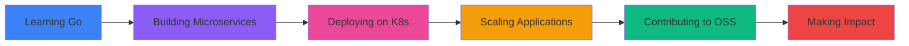

<h1 align="center">
    
</h1>
<h3 align="center">A passionate  developer from India</h3>
 
<p align="left">  </p>
# Hi there, I'm [ JAIMIN PARAJAPATI ] 👋
### A passionate developer from India 🇮🇳

<p align="left">
 
 
</p>

---

### 💫 About Me:
- 🔭 I’m currently working on **[Project Name]**
- 🌱 I’m currently learning **[New Technology, e.g., Next.js or Go]**
- 👯 I’m looking to collaborate on **Open Source projects**
- 💬 Ask me about **Web Apps, UI/UX, or Python**
- 📫 How to reach me: **[jaiminkatakiya7600@gmail.com]**

### 🛠 Tech Stack:
<p align="left">
  
</p>


</div>

## ⚡ Quick Look
- 🔭 **Current Focus:** Building scalable web applications.
- 🚀 **Main Goal:** To contribute to impactful open-source projects.
- ☕ **Philosophy:** "Code is like humor. When you have to explain it, it’s bad."


<div align="center">

</div>

<a href="https://twitter.com/jaimin" target="blank">
# Hi there, I'm Jaimin Katakiya 👋

<div align="center">
  
[](https://git.io/typing-svg)

</div>

<p align="center">
  
  
</p>

---

## 🎯 About Me

```python
class Developer:
    def __init__(self):
        self.name = "Jaimin Katakiya"
        self.role = "Full Stack Developer"
        self.location = "India 🇮🇳"
        self.current_focus = "Building scalable web applications"
        self.philosophy = "Code is like humor. When you have to explain it, it's bad."
        
    def get_current_stack(self):
        return {
            "frontend": ["React", "Next.js", "TypeScript", "Tailwind CSS"],
            "backend": ["Node.js", "Python", "Django", "Express.js"],
            "database": ["PostgreSQL", "MongoDB", "Redis"],
            "tools": ["Git", "Docker", "AWS", "Vercel"],
            "currently_learning": ["Go", "Kubernetes", "System Design"]
        }
    
    def get_goals(self):
        return [
            "🚀 Contribute to impactful open-source projects",
            "📚 Master system design and architecture",
            "🌍 Build products that solve real-world problems",
            "🤝 Collaborate with amazing developers worldwide"
        ]

me = Developer()
print(me.get_current_stack())
```

<details>
<summary>📊 More About My Coding Journey</summary>
<br>

- 🔭 **Currently Working On:** Building modern web applications with Next.js and TypeScript
- 🌱 **Learning:** Go, Kubernetes, Advanced System Design
- 👯 **Open For:** Collaborating on innovative open-source projects
- 💬 **Ask Me About:** Web Development, UI/UX Design, Python, JavaScript, React
- 📫 **Reach Me:** [jaiminkatakiya7600@gmail.com](mailto:jaiminkatakiya7600@gmail.com)
- ⚡ **Fun Fact:** I debug with console.log and I'm proud of it! 😄

</details>

---

## 🛠️ Tech Stack

<div align="center">

### 💻 Languages


### 🎨 Frontend Development


### ⚙️ Backend Development


### 🗄️ Databases


### ☁️ Cloud & DevOps


### 🔧 Tools & Platforms


</div>

---

## 📊 GitHub Statistics

<div align="center">
  
  
</div>

<div align="center">
  
  
</div>

---

## 🏆 GitHub Trophies

<div align="center">
  
</div>

---

## 🔥 Featured Projects

<div align="center">

[](https://github.com/jaiminkatakiya/your-awesome-project)
[](https://github.com/jaiminkatakiya/another-cool-project)

</div>

---

## 📈 Contribution Graph

<div align="center">
  
</div>

---

## 💼 What I'm Currently Working On

<div align="center">



</div>

---

## 🌐 Let's Connect

<div align="center">

[](https://linkedin.com/in/jaiminkatakiya)
[](https://twitter.com/jaiminkatakiya)
[](https://yourportfolio.com)
[](mailto:jaiminkatakiya7600@gmail.com)
[](https://dev.to/jaiminkatakiya)
[](https://stackoverflow.com/users/yourid)

</div>

---

## 💭 Random Dev Quote

<div align="center">


</div>

---

## 🎵 Coding Playlist

<div align="center">

[](https://open.spotify.com/user/youruserid)

</div>

---

## ☕ Support My Work

<div align="center">

If you like my projects, consider buying me a coffee! ☕

[](https://www.buymeacoffee.com/jaiminkatakiya)
[](https://paypal.me/jaiminkatakiya)

</div>

---

<div align="center">
  
### 📝 Latest Blog Posts

<!-- BLOG-POST-LIST:START -->
<!-- BLOG-POST-LIST:END -->

</div>

---

<div align="center">
  
### "Talk is cheap. Show me the code." - Linus Torvalds


⭐️ From [jaiminkatakiya](https://github.com/jaiminkatakiya)

</div>

